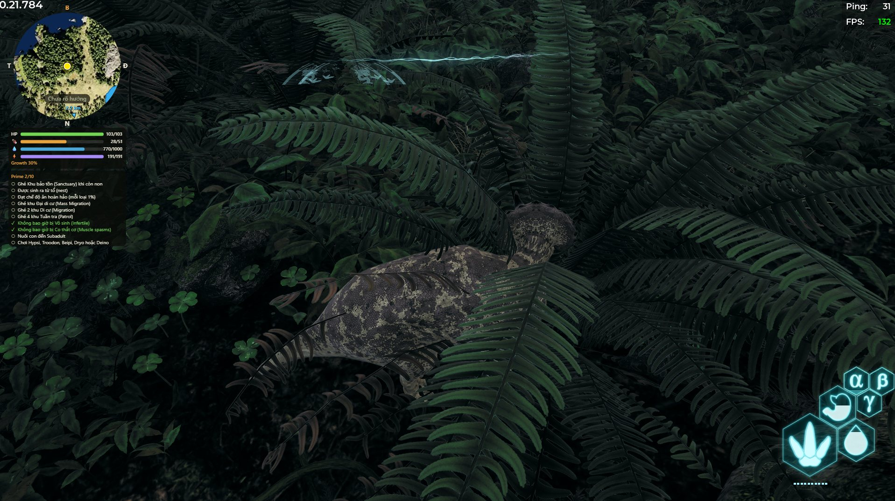
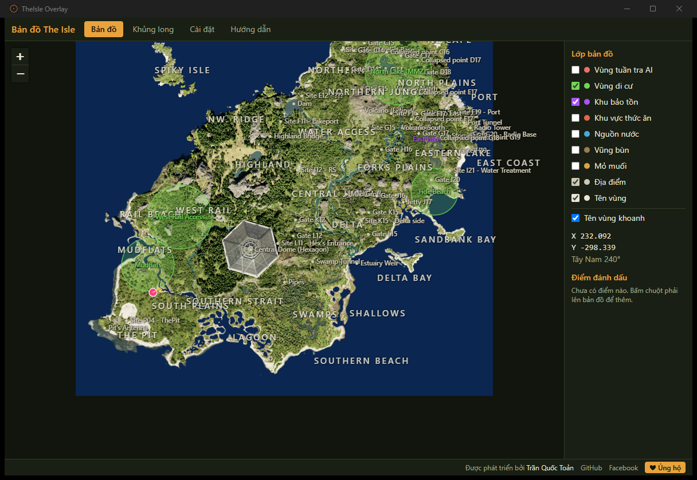
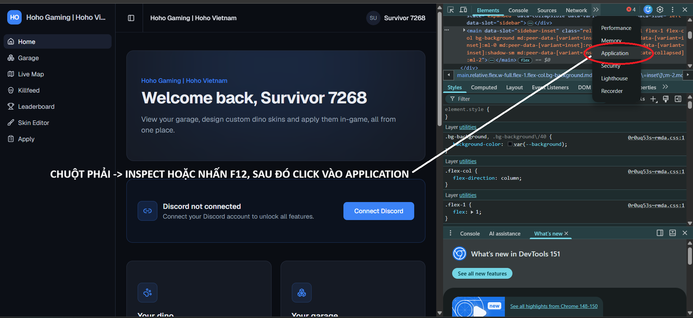

# TheIsle Overlay

[Tiếng Việt](README.md) · **English**

Map overlay for **The Isle: Evrima** (Gateway). Circular minimap pinned to the
game window · full map with POIs, place names, waypoints and travel trails ·
your dino's stats from the server's IslePilot panel · bilingual VI/EN
interface · one-click install with auto-update.





## Features

- **Circular minimap** pinned to a corner of the game window, click-through so it
  never blocks play. North stays up, with an arrow showing your direction of travel.
- **Full map**: smooth zoom/pan, 11 toggleable layers (fresh water, water, salt licks,
  mud wallows, sanctuaries, migration zones, AI patrol zones, food zones, animals
  with per-species icons 🐗🦌🐢, region names, landmarks), with place names drawn
  directly on the map; a clear-trail button to declutter mid-session.
- **3 basemap styles**: Vulnona captures (default) or the hand-drawn
  [IsleMaps](https://www.islemaps.com/) light/dark art — switch in Settings,
  applies to both the full map and the minimap. The IsleMaps art tracks a newer
  game build and shows the SE archipelago (Hell's Mouth).
- **Waypoints**: right-click to drop, rename/recolor, delete, quick icons
  (💀 death spot, 🏠 nest…); the minimap gets a rim arrow with bearing +
  distance to the nearest one.
- **Search & navigation**: search places/waypoints, paste coordinates to jump
  there, follow mode with an edge arrow leading back to your position.
- **Travel trail** recorded per session, with the previous session's path restored.
- **Your dino**: growth, health, hunger, thirst and Prime progress read from the
  server's IslePilot panel, plus a compact stats strip under the minimap.
- **Global hotkeys** rebindable in-app, bilingual UI, automatic updates.

## Install

Download `TheIsle Overlay_x.x.x_x64-setup.exe` from
[Releases](https://github.com/toantranct/theisle-overlay/releases) and run it.
On first launch the app downloads the map data (~3 MB) to your machine.

Requires **Windows 10/11 64-bit**. WebView2 is already present on most Windows 11
installs; the installer fetches it if missing.

> Windows may show a SmartScreen warning because the installer is not
> code-signed. Click **More info → Run anyway**.

## Connecting "Your Dino" (IslePilot)

The **Dino** tab reads your own dino's stats (growth, health, hunger, thirst,
Prime progress) from the server's IslePilot panel. Two ways to connect — pick one:

**Method 1 — Steam login (fastest):** open the Dino tab → enter the server
link → click **Steam login** → sign in in the window that opens. Done.

**Method 2 — Paste the cookie manually** (when method 1 fails):

1. Open the server page in your browser and sign in with Steam there. Press
   **F12** (or right-click → **Inspect**) and open the **Application** tab
   (Chrome) / **Storage** (Firefox).

   

2. Pick **Cookies** → the server's domain → click the **`islepilot_player`**
   cookie → copy the whole **Value**. Treat this string like a password.

   

3. In the app: paste it into the cookie box → click **Verify & save cookie**.

   

If the server runs a **live map**, the app detects it and enables automatic
position — no manual coordinate copying needed; when the server has the live
map disabled the option locks itself off.

**Some servers using IslePilot** (examples — any IslePilot-powered server works):

- https://mixi.islepilot.eu
- https://hoho.islepilot.eu
- https://sdvn.islepilot.eu
- https://sdvn2.islepilot.eu
- https://khunglong.islepilot.eu
- https://islepilot.eu/p/sbtcisland

## How light is it?

Measured on a real machine: **Intel Core i5-14400F (10 cores / 16 threads), 32 GB
RAM, RTX 3060 Ti, Windows 11 Pro build 26200, 100% display scaling** — release
build v1.0.0:

| Item | Size |
|---|---|
| Installer | **4.3 MB** |
| Installed executable | 17.8 MB |
| Map data downloaded on first run | 2.9 MB (2.6 MB basemap + 0.3 MB point data) |
| **Total disk footprint** | **~21 MB** |

| At runtime | RAM (working set) | Idle CPU |
|---|---|---|
| Full map **and** minimap open | **522 MB** (8 processes) | 0.18% |
| Full map hidden with `Ctrl+Alt+F` (the while-playing scenario) | **448 MB** | 0.08% |

**CPU is essentially zero** because the app has no repaint loop — it draws only
when new data arrives.

## Things to know

1. **Game display mode**: no out-of-process overlay can draw over **Exclusive
   Fullscreen** — a Windows limitation. Use **Windowed** or **Borderless
   Fullscreen**. The app reads your game config and warns you if the mode is wrong.
2. **Position does not update by itself**: you press `Tab` → **Asset Location** in
   game whenever you want a position update. This is *deliberate* — see the
   anti-cheat section below.
3. **Heading needs two coordinate copies** at least 20 m apart; samples older than
   10 minutes expire so the arrow never points the wrong way.
4. **Only one instance can run** — global hotkeys are system-exclusive, so two
   copies would fight over them.
5. **Low-RAM machines**: hide the full map with `Ctrl+Alt+F` while playing —
   the app trims the hidden window's memory. Clicking X parks the app in the
   **system tray** (icon next to the clock), Steam/Discord-style — left-click
   the icon to bring it back, right-click → Quit to exit fully.
6. **Hotkeys taken by another app** are reported at startup; rebind them in Settings.
7. **The "Your dino" feature** supports IslePilot-based servers
   (`xxx.islepilot.eu` or `islepilot.eu/p/server-name` — see
   [Connecting "Your Dino"](#connecting-your-dino-islepilot)). It reads data by
   parsing the server's web pages (there is no official API), so it **can break
   whenever IslePilot changes their markup** — the app flags it when it detects
   a new deployment. If this part fails, the map features are **unaffected**.
8. **Ask your server admins** before using it routinely — some servers have their
   own rules about third-party tools. Auto-position only turns on when the app
   detects that the server runs a live map; it locks itself off when the live map
   is disabled, and a manual choice you make is always respected.
9. **Your panel session cookie** is encrypted with Windows DPAPI and can only be
   decrypted by your Windows account on that machine.
10. **SmartScreen** warns on first install because the installer is not code-signed
   (certificates cost a yearly fee). Later auto-updates are not prompted again.

## Anti-cheat safety

The game runs kernel-level Easy Anti-Cheat. This app is safe because it
**never touches the game process**:

- Position comes only from the **clipboard**, when you press Tab → "Asset
  Location" in game yourself — the app just reads back what the game
  voluntarily hands over.
- Hotkeys use `RegisterHotKey` (Windows' cooperative API), **not** a keyboard
  hook.
- Dino stats come over **HTTPS from the server's own website** (the IslePilot
  panel) — again, nothing to do with the game process.
- Never: reading game memory, DLL injection, DirectX hooks, synthetic input,
  packet capture, auto-copying coordinates on a timer, or sharing positions
  between players.

CI greps for any forbidden API call site (`scripts/check-forbidden-apis.ps1`).
The allowed-call list lives at the top of `src-tauri/src/win/mod.rs`.

## Development

Requirements: Node 22+, Rust stable (MSVC), WebView2.

```powershell
npm install
npx tauri dev                        # run dev

# Drive the UI without the game running:
$env:THEISLE_REPLAY = "path\to\replay_sample.txt"; npx tauri dev

# Tests
npm run check                        # svelte-check
cd src-tauri; cargo test --workspace # all Rust tests
cargo clippy --workspace -- -D warnings
..\scripts\check-forbidden-apis.ps1

# After each in-game map update (run for every downloaded basemap):
cargo run --bin verify_data --features devtools -- --source vulnona
cargo run --bin verify_data --features devtools -- --source islemaps-light
cargo run --bin verify_data --features devtools -- --source islemaps-dark
cargo test -p theisle-overlay --lib -- --ignored parse_real_cache
```

Note: `.cargo/config.toml` moves the `target-dir` outside the OneDrive-synced
folder.

## Credits

Map data is **fetched on first run, never bundled** — it is a personal copy on
your machine, not a redistribution.

- Basemap: [VulnonaMAP](https://vulnona.com/game/map/) (Coco.N) — stitched
  from in-game captures. Imagery copyright Afterthought LLC (The Isle).
- IsleMaps basemap (optional, downloaded only when selected in Settings) and
  animal spawn points: [islemaps.com](https://www.islemaps.com/) (Pont & Emeara).
- POIs: [myislemap.com](https://myislemap.com/), VulnonaMAP, wiredredman's
  Steam guide.

Unaffiliated with Afterthought LLC.

## Contact & Support

Developed by **Trần Quốc Toản**.

- 📧 Email: toantranct1@gmail.com
- 💬 Facebook: https://www.facebook.com/satann247/
- 🐛 Bugs / suggestions: [GitHub Issues](https://github.com/toantranct/theisle-overlay/issues)

The app is free and open source. If you find it useful, you can buy the
author a coffee:


**Techcombank · 8866886767 · TRAN QUOC TOAN**
