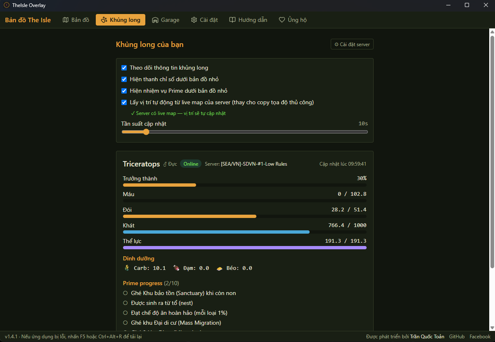

# TheIsle Overlay — Navigation HUD + Night Vision Community Fork

[Tiếng Việt](README.md) · **English**

> **Community navigation fork** maintained by
> [@nguyenduytamgithub](https://github.com/nguyenduytamgithub). It is derived
> from the public
> [`toantranct/theisle-overlay` v1.5.2](https://github.com/toantranct/theisle-overlay/tree/v1.5.2)
> code at commit `f628a18`. Original project and author: **Trần Quốc Toản**.

The current source is the **v1.7.1 Visual Night Boost candidate**; the latest
public download remains v1.7.0 until the candidate passes a real dark-scene
acceptance check. Its goal is reliable position, heading, trails, waypoint
guidance, and useful dark-scene visibility without touching game memory or Easy
Anti-Cheat.

Upstream 2.x is now a closed-source release with separate Pro features. This
fork does **not** contain 2.x voice, friend positions, the skin editor, or Pro
realtime. The comparison below is strictly against the open-source **v1.5.2**
baseline.

Map overlay for **The Isle: Evrima** (Gateway). Circular minimap pinned to the
game window · full map with POIs, place names, waypoints and travel trails ·
dino stats + Garage (Gacha) with **3D preview** from the IslePilot system, one
Steam login **for every server** · bilingual VI/EN interface · small Windows
installer with manual fork updates.

## What does this fork improve?

| While playing | Open-source upstream v1.5.2 | Visual Night Boost v1.7.1 candidate |
|---|---|---|
| IslePilot position polling | 10-second default | **5-second** default; existing custom values remain unchanged |
| Motion between server samples | Position jumps on every response | Up to **4 seconds** of bounded visual prediction, then freezes for confirmation; **350 ms** correction blend |
| Bad coordinate spikes | Can draw a trail kilometres away | Impossible samples are quarantined; a far relocation needs **two consistent samples** |
| Heading | Mainly inferred from travelled path | Prefers fresh **server yaw**, with motion heading as fallback |
| Waypoints | Rim arrow points to the nearest waypoint | Pick one explicit destination shared by the full map, minimap, and HUD |
| In-game guidance | No dedicated navigation HUD | Click-through top-centre HUD with compass, degrees, turn arrow, target name, and distance |
| Delayed data | Freshness is unclear | Explicit **SERVER / ESTIMATE / STALE** state |
| Alt-Tab and WebView failure | Minimap follows game focus | HUD also auto-hides, re-anchors, and self-heals |
| Scenes too dark to read | No dedicated visibility control | Painted click-through brightness layer plus supplemental gamma; **NIGHT VISION** button + `Ctrl+Alt+N`, strength 0–100, focus-aware hide/reapply |

Smooth motion is a **bounded estimate**, not fake realtime. The server still
confirms real coordinates every five seconds. Without IslePilot live-map
support, use `Tab` → **Asset Location** as before.

▶️ **Install & usage video guide** (Vietnamese):

[](https://y2u.be/R2IzwqHapuw)




## Features

- **Circular minimap** pinned to a corner of the game window, click-through so it
  never blocks play. North stays up; its rim arrow points to the waypoint you selected.
- **In-game Navigation HUD**: N/E/S/W compass, heading in degrees, required-turn
  arrow, target name, distance, and data freshness; auto-hides on Alt-Tab and
  toggles with `Ctrl+Alt+H`.
- **Display Night Vision**: a top-right **NIGHT VISION** button plus
  `Ctrl+Alt+N`, with strength 0–100 in Settings. v1.7.1 uses a static,
  click-through brightness layer with a painted acknowledgement; display gamma
  is supplemental. It hides on Alt-Tab, repaints on return, and cleans up on
  switch-off or exit. Strength 70 is the default; raise it if still dark or
  lower it if the image looks washed out.
- **Full map**: smooth zoom/pan, 12 toggleable layers (fresh water, water, salt licks,
  mud wallows, sanctuaries, migration zones, AI patrol zones, food zones, animals
  with per-species icons 🐗🦌🐢, region names, landmarks, and a live **server
  POI** layer from IslePilot), with place names drawn directly on the map; a
  collapsible layer list and a clear-trail button to declutter mid-session.
  Opening the map by hotkey lands on the map tab.
- **3 basemap styles**: Vulnona captures (default) or the hand-drawn
  [IsleMaps](https://www.islemaps.com/) light/dark art — switch in Settings,
  applies to both the full map and the minimap. The IsleMaps art tracks a newer
  game build and shows the SE archipelago (Hell's Mouth).
- **Waypoints**: right-click to drop, rename/recolor, delete, quick icons
  (💀 death spot, 🏠 nest…); select **Navigate to this waypoint** so the full
  map, minimap, and HUD all use the same destination.
- **Search & navigation**: search places/waypoints, paste coordinates to jump
  there, and draw a direct line and arrow from your position to the selected
  destination; arrival is reported inside a 15 m radius.
- **More reliable travel trail** recorded per session: the previous session is
  restored, impossible jumps are rejected, and predicted display points are
  never written into history.
- **Your dino**: growth, health, hunger, thirst, stamina, Carb/Protein/Lipid
  nutrition and Prime progress (with Vietnamese translation) from the IslePilot
  system; compact stats strip + Prime quest card under the minimap. One Steam
  login works on **every IslePilot server** — switch servers and the data follows.
- **Garage (Gacha) with 3D preview**: each parked dino is a card with an
  orbitable **3D model in its own skin colours** + growth + Park/Restore/
  Rename/Sell; models download once and open instantly (and offline) after.
- **Global hotkeys** rebindable in-app, bilingual UI, plus `Ctrl+Alt+H` and a
  HUD opacity control in Settings.

## Quick install

1. Open the [fork Releases](https://github.com/nguyenduytamgithub/theisle-overlay/releases)
   and download `TheIsle Overlay_1.7.0_x64-setup.exe` from
   **v1.7.0-night-vision**.
2. Exit any older Overlay from the system tray, then run the installer. Existing
   settings and waypoints are preserved.
3. If SmartScreen warns, choose **More info → Run anyway**. The installer is
   unsigned; verify the SHA-256 published on the Release page.
4. Set The Isle to **Windowed** or **Borderless Fullscreen**. Windows cannot draw
   an external overlay over Exclusive Fullscreen.
5. Launch the app once; first run downloads about 3 MB of map data.

Requires **Windows 10/11 64-bit**. WebView2 is already present on most Windows 11
installs; the installer fetches it if missing.

This fork uses **manual updates**. Do not accept an upstream 2.x update if you
want to keep Navigation HUD; install future builds from this fork's Releases.

## Using Navigation HUD and waypoint guidance

1. Connect IslePilot as described below. A server with live-map support updates
   position every five seconds; otherwise press `Tab` → **Asset Location** in game.
2. Open the full map with `Ctrl+Alt+F`.
3. Right-click the destination to create a waypoint, or select a saved waypoint.
4. Choose **Navigate to this waypoint** from its menu.
5. Return to the game. The HUD shows heading, turn arrow, and distance; the
   minimap points to the same target. Choose **Stop navigation** when finished.

| Key | Action |
|---|---|
| `Ctrl+Alt+H` | Toggle Navigation HUD |
| `Ctrl+Alt+N` | Toggle Night Vision |
| `Ctrl+Alt+M` | Toggle minimap |
| `Ctrl+Alt+F` | Show/hide the full map |
| `Ctrl+Alt+R` | Reload the UI if minimap/HUD stops drawing |
| `Ctrl+Alt+C` | Toggle minimap click-through |
| `Ctrl+Alt+Up/Down` | Increase/decrease minimap opacity |
| `Ctrl+Alt+Left/Right` | Increase/decrease minimap size |

All shortcuts are rebindable in **Settings**. The HUD hides when the game is not
foreground; that is expected behavior, not an app shutdown.

## Connecting "Your Dino" (IslePilot)

The **Dino** tab reads your own dino's stats (growth, health, hunger, thirst,
stamina, nutrition, Prime progress) from the IslePilot system. Two ways to
connect:

**Method 1 — Steam login via IslePilot (recommended):** open the Dino tab →
click **Steam login** → sign in in the islepilot.eu window that opens; it
closes itself when done. Do this **once** — no server link needed, it works on
**every IslePilot server**, and switching servers in game follows automatically.
This login also unlocks the **Garage (Gacha)** tab and the **server POI** map
layer. If the window fails to catch the token, open *"Or paste the token
manually"* and paste the token (or the whole `theisle-overlay://…` link).

**Method 2 — Legacy: server link + cookie** (only when method 1 does not work;
the cookie is stored per server, so switching servers means doing it again).
Open the **"Legacy"** section of the login card, enter the server link and
click Steam login there; if that still fails, paste the cookie manually:

1. Open the server page in your browser and sign in with Steam there. Press
   **F12** (or right-click → **Inspect**) and open the **Application** tab
   (Chrome) / **Storage** (Firefox).

   

2. Pick **Cookies** → the server's domain → click the **`islepilot_player`**
   cookie → copy the whole **Value**.

   

3. In the app: paste it into the cookie box → click **Verify & save cookie**.

   

If the server runs a **live map**, the app detects it and enables automatic
position — no manual coordinate copying needed; when the server has the live
map disabled the option locks itself off.

**Some servers using IslePilot** (examples — any IslePilot-powered server works):

- https://mixi.islepilot.eu
- https://hoho.islepilot.eu
- https://sdvn.islepilot.eu
- https://sdvn2.islepilot.eu
- https://khunglong.islepilot.eu
- https://islepilot.eu/p/sbtcisland

## How light is it?

The v1.7.1 candidate identity, installation, and runtime evidence are recorded
in the [verification record](docs/verification/night-boost-v1.7.1.md). Its hash
must not be presented as a public release until real dark-scene acceptance.

| Item | Size |
|---|---|
| v1.7.1 candidate NSIS installer | **5,806,573 bytes (~5.8 MB)** |
| v1.7.1 candidate installed executable | **21,370,880 bytes (~21.4 MB)** |
| Map data downloaded on first run | 2.9 MB (2.6 MB basemap + 0.3 MB point data) |

The HUD caps DOM writes at roughly 30 FPS and predicts only while a moving sample
is active; there is no background game-memory reader or scanner. Runtime RAM
depends on WebView2, open tabs, and cached 3D models, so this fork does not publish
one fixed RAM claim.

## Things to know

1. **Game display mode**: no out-of-process overlay can draw over **Exclusive
   Fullscreen** — a Windows limitation. Use **Windowed** or **Borderless
   Fullscreen**. The app reads your game config and warns you if the mode is wrong.
2. **Automatic position depends on the server**: an IslePilot live map confirms
   position every five seconds by default. Between responses the app estimates for
   at most four seconds. If live map is disabled, use `Tab` → **Asset Location**.
3. **Heading prefers server yaw**. Without yaw, the app needs at least two valid
   movement samples to infer direction; stale data becomes **STALE** instead of
   continuing to point confidently.
4. **Night Vision v1.7.1 requires Windowed/Borderless** so Windows can compose
   its brightness layer over the game; out-of-process overlays cannot appear in
   Exclusive Fullscreen. Lower strength if the picture looks washed out. If the
   state ever sticks, press `Ctrl+Alt+N` once to cleanly switch off, then turn it
   on again. There is no game process handle, memory read, hook/capture, or
   synthetic input.
5. **Only one instance can run** — global hotkeys are system-exclusive, so two
   copies would fight over them.
6. **Low-RAM machines**: hide the full map with `Ctrl+Alt+F` while playing —
   the app trims the hidden window's memory. Clicking X parks the app in the
   **system tray** (icon next to the clock), Steam/Discord-style — left-click
   the icon to bring it back, right-click → Quit to exit fully.
7. **Hotkeys taken by another app** are reported at startup; rebind them in Settings.
8. **The "Your dino" feature** supports IslePilot-based servers — see
   [Connecting "Your Dino"](#connecting-your-dino-islepilot). The recommended
   Steam-login mode reads a stable JSON API; only the legacy server + cookie
   mode parses the server's web pages, so that path **can break whenever
   IslePilot changes their markup** — the app flags it when it detects a new
   deployment. If this part fails, the map features are **unaffected**.
9. **Ask your server admins** before using it routinely — some servers have their
   own rules about third-party tools. Auto-position only turns on when the app
   detects that the server runs a live map; it locks itself off when the live map
   is disabled, and a manual choice you make is always respected.
10. **Your login token/cookie** is encrypted with Windows DPAPI and can only be
   decrypted by your Windows account on that machine.
11. **SmartScreen** may warn because the installer is not code-signed. Compare its
    SHA-256 with the Release page and update this fork manually.

## Anti-cheat safety

The game runs kernel-level Easy Anti-Cheat. This app is safe because it
**never touches the game process**:

- Position comes over **HTTPS from IslePilot live map** when the server allows it,
  or from the **clipboard** after you press `Tab` → **Asset Location**. Both are
  server/game-provided data outside the game process.
- Hotkeys use `RegisterHotKey` (Windows' cooperative API), **not** a keyboard
  hook.
- Night Vision uses a static, opacity-controlled, click-through WebView that
  never captures pixels; Windows gamma readback/recovery is supplemental. It
  never obtains game content.
- Dino stats / Garage / 3D models come over **HTTPS from the IslePilot system**
  (the islepilot.eu API or the server's own website) — again, nothing to do
  with the game process.
- Never: reading game memory, DLL injection, DirectX hooks, synthetic input,
  packet capture, automatically copying coordinates out of the game, or sharing
  positions between players.

CI greps for forbidden call sites (`scripts/check-forbidden-apis.ps1`) and the
dedicated `night_vision_safety` test locks Night Vision to display-only APIs.
The allowed-call list lives at the top of `src-tauri/src/win/mod.rs`.

## Development

Requirements: Node 22+, Rust stable (MSVC), WebView2.

```powershell
npm install
npx tauri dev                        # run dev

# Drive the UI without the game running:
$env:THEISLE_REPLAY = "path\to\replay_sample.txt"; npx tauri dev

# Tests
npm run check                        # svelte-check
cd src-tauri; cargo test --workspace # all Rust tests
cargo clippy --workspace -- -D warnings
..\scripts\check-forbidden-apis.ps1

# After each in-game map update (run for every downloaded basemap):
cargo run --bin verify_data --features devtools -- --source vulnona
cargo run --bin verify_data --features devtools -- --source islemaps-light
cargo run --bin verify_data --features devtools -- --source islemaps-dark
cargo test -p theisle-overlay --lib -- --ignored parse_real_cache
```

Note: `.cargo/config.toml` moves the `target-dir` outside the OneDrive-synced
folder.

## Credits

Map data is **fetched on first run, never bundled** — it is a personal copy on
your machine, not a redistribution.

- Basemap: [VulnonaMAP](https://vulnona.com/game/map/) (Coco.N) — stitched
  from in-game captures. Imagery copyright Afterthought LLC (The Isle).
- IsleMaps basemap (optional, downloaded only when selected in Settings) and
  animal spawn points: [islemaps.com](https://www.islemaps.com/) (Pont & Emeara).
- POIs: [myislemap.com](https://myislemap.com/), VulnonaMAP, wiredredman's
  Steam guide.

Unaffiliated with Afterthought LLC.

## Origin, licensing, and contact

- Navigation HUD fork: maintained by
  [@nguyenduytamgithub](https://github.com/nguyenduytamgithub); report fork bugs
  in [fork Issues](https://github.com/nguyenduytamgithub/theisle-overlay/issues).
- Original v1.5.2 project and code: **Trần Quốc Toản** —
  [`toantranct/theisle-overlay`](https://github.com/toantranct/theisle-overlay).
- Upstream currently has no `LICENSE` file. This fork does not invent a new
  license; public source visibility is not a substitute for license terms.

The upstream author's contact and support details are preserved below for
proper attribution:

- 📧 Email: toantranct1@gmail.com
- 💬 Facebook: https://www.facebook.com/satann247/
- 🐛 Upstream Issues: [GitHub Issues](https://github.com/toantranct/theisle-overlay/issues)

If the original foundation is useful, you can buy the upstream author a coffee:


**Techcombank · 8866886767 · TRAN QUOC TOAN**
